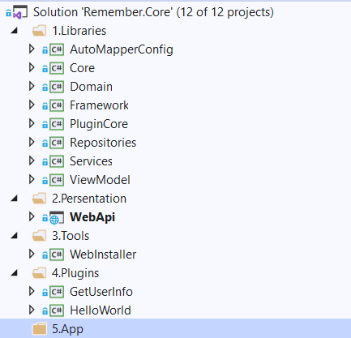
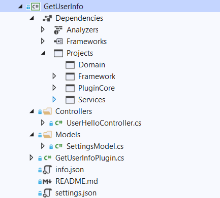

<p align="center">

</p>
<h1 align="center">Remember.Core</h1>

> :dolphin: .NET Web 应用框架

[]()
[](https://github.com/yiyungent/Remember.Core/blob/master/LICENSE)


<!-- [English](README_en.md) -->


> __注意:__              
> 本项目插件部分现已封装为类库，如果你仅仅需要快速实现插件系统，请见
> [PluginCore](https://github.com/yiyungent/PluginCore)


## 介绍

一个轻量的 Web 应用框架, 具有优雅、高效、简洁、富于表达力等优点。采用 前后端分离 设计，是崇尚开发效率的全栈框架

- **简单** - 享受5分钟安装, 轻松上手。
- **易扩展** - 插件化架构, 轻松扩展。

## 在线演示

- 暂无

## 截图


## 项目分层



## 插件开发

#### 1. 引入插件框架dll（PluginCore 必须，其它根据需要）

> 一个示例插件项目结构 如下图



#### 2. 添加 `GetUserInfoPlugin` 类 继承 `BasePlugin`

> 或则你可以直接实现 `IPlugin`

> 可通过预先定义框架行为钩子，插件再实现接口，将插件行为加入框架，如实现  `ITestPlugin`

> 支持插件 `构造器注入` 框架预先注入的服务等

```c#
public class GetUserInfoPlugin : BasePlugin, ITestPlugin
{
    private readonly IUserInfoService _userInfoService;

    public GetUserInfoPlugin(IUserInfoService userInfoService)
    {
        this._userInfoService = userInfoService;
    }

    public string Say()
    {
        UserInfo userInfo = _userInfoService.FirstOrDefaultAsync(m => !m.IsDeleted).Result;
        string rtn = $"用户名: {userInfo.UserName}, 创建时间: {userInfo.CreateTime.ToString()}";

        return rtn;
    }

    public override (bool IsSuccess, string Message) AfterEnable()
    {
        Console.WriteLine($"{nameof(GetUserInfoPlugin)}: {nameof(AfterEnable)}");
        return base.AfterEnable();
    }

    public override (bool IsSuccess, string Message) BeforeDisable()
    {
        Console.WriteLine($"{nameof(GetUserInfoPlugin)}: {nameof(BeforeDisable)}");
        return base.BeforeDisable();
    }
}
```

#### 3. 插件其他配置

> 支持 动态扩展 WebAPI，和普通WebAPI 项目相同，直接创建 Controller 即可

```C#
[Route("api/plugins/[controller]")]
[ApiController]
public class UserHelloController : ControllerBase
{
    private readonly IUserInfoService _userInfoService;

    public UserHelloController(IUserInfoService userInfoService)
    {
        this._userInfoService = userInfoService;
    }

    public ActionResult Get()
    {
        UserInfo userInfo = _userInfoService.FirstOrDefaultAsync(m => !m.IsDeleted).Result;
        SettingsModel settingsModel = PluginSettingsModelFactory.Create<SettingsModel>("GetUserInfo");
        string rtn = $"用户名: {userInfo.UserName}, 创建时间: {userInfo.CreateTime.ToString()}, Hello: {settingsModel.Hello}";

        return Ok(rtn);
    }
}
```

> 插件设置（可选）, Json Model 类 继承 `PluginSettingsModel`

```C#
public class SettingsModel : PluginSettingsModel
{
    public string Hello { get; set; }
}
```

文件名必须 `settings.json`
```json
{
	"Hello": "哈哈哈哈哈或或或或或或" 
}
```

> 插件描述 `info.json` （必需）

```json
{
	"PluginId": "GetUserInfo",
	"DisplayName": "获取一个用户",
	"Description": "这是一个示例插件2号。",
	"Author": "yiyun",
	"Version": "0.1.0",
	"SupportedVersions": [ "0.0.1" ]
}
```

> 插件文档 `README.md`（可选）, 文件名必须 README.md

```markdown
## 说明文档（可选）

- [] 这是一个示例插件
- [x] 感谢使用
```

#### 3. 插件发布打包

> 右键选择插件项目，点击发布（Publish），再将发布后的插件文件夹打包为 `GetUserInfo.zip` 即可  
> 压缩包名可随意，框架将以 `info.json` 中 `PluginId` 作为插件标识

> 打包后的插件，即可通过 上传本地插件 载入框架

> GetUserInfo.csproj 参考

```xml
<Project Sdk="Microsoft.NET.Sdk">

  <PropertyGroup>
    <TargetFramework>netcoreapp3.1</TargetFramework>
  </PropertyGroup>

  <ItemGroup>
    <ProjectReference Include="..\..\src\Framework\Libraries\Domain\Domain.csproj" />
    <ProjectReference Include="..\..\src\Framework\Libraries\Framework\Framework.csproj" />
    <ProjectReference Include="..\..\src\Framework\Libraries\PluginCore\PluginCore.csproj" />
    <ProjectReference Include="..\..\src\Framework\Libraries\Services\Services.csproj" />
  </ItemGroup>

  <ItemGroup>
    <None Update="info.json">
      <CopyToOutputDirectory>Always</CopyToOutputDirectory>
    </None>
    <None Update="README.md">
      <CopyToOutputDirectory>Always</CopyToOutputDirectory>
    </None>
    <None Update="settings.json">
      <CopyToOutputDirectory>Always</CopyToOutputDirectory>
    </None>
  </ItemGroup>

</Project>
```


## 使用

本框架主要提供了插件框架的简单实现样板，如果你想要实现一个Web插件框架，你可以参考本框架的代码。
目前运行本框架 还需要 同时运行 以下两个

- [remember-default-admin-theme](https://github.com/yiyungent/remember-default-admin-theme) 本框架的 Vue.js 前端
- [UHub](https://github.com/yiyungent/UHub) 统一身份认证

## 环境

- 运行环境: .NET Core 3.1
- 开发环境: Visual Studio Community 2019

## 相关项目

- [remember-default-admin-theme](https://github.com/yiyungent/remember-default-admin-theme)
- [remember-app](https://github.com/yiyungent/remember-app)
- [remember-uni-app](https://github.com/yiyungent/remember-uni-app)
- [remember](https://github.com/yiyungent/remember)
- [PluginCore](https://github.com/yiyungent/PluginCore)

## 鸣谢

- 插件系统设计参考自 <a href="https://github.com/lamondlu/Mystique" target="_blank">Mystique</a>，感谢作者 lamondlu 的贡献
- 设计参考自 <a href="https://github.com/lampo1024/TsBlog" target="_blank">TsBlog</a>，感谢作者 lampo1024 的贡献
- 设计参考自 <a href="https://github.com/nopSolutions/nopCommerce" target="_blank">nopCommerce</a>，感谢作者 nopSolutions 的贡献
- 设计参考自 <a href="https://github.com/anjoy8/Blog.Core" target="_blank">Blog.Core</a>，感谢作者 anjoy8 的贡献

## Donate

Remember.Core is an Apache-2.0 licensed open source project and completely free to use. However, the amount of effort needed to maintain and develop new features for the project is not sustainable without proper financial backing.

We accept donations through these channels:

- <a href="https://afdian.net/@yiyun" target="_blank">爱发电</a>

## Author

**Remember.Core** © [yiyun](https://github.com/yiyungent), Released under the [Apache-2.0](./LICENSE) License.<br>
Authored and maintained by yiyun with help from contributors ([list](https://github.com/yiyungent/Remember.Core/contributors)).

> GitHub [@yiyungent](https://github.com/yiyungent)
